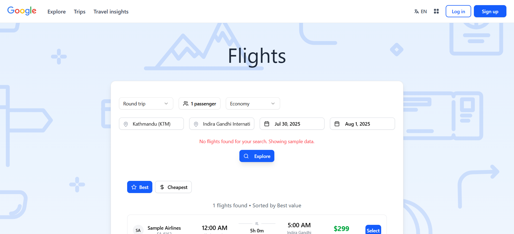

# ✈️ Flight Search App (Google Flights Clone)

A full-featured flight search app inspired by Google Flights — built with **React**, **Tailwind CSS**, and **RapidAPI's SkyScrapper API**. It lets users search flights with real-time or fallback mock data.

---

## 📸 Preview

  

>>>>>>> 5435786eaf18acf7a291c16ac535d332dc91b503

---

## 🚀 Features

- 🔍 Autocomplete for "From" and "To" airports
- 📅 Date pickers for departure and return
- 👨‍👩‍👧‍👦 Passenger selector with validation
- 🎫 Travel class filter (Economy, Business, etc.)
- 📊 Live or mock flight results with error handling
- 📱 Responsive and clean UI

---

## 🛠️ Tech Stack

- **React** – Frontend library  
- **Tailwind CSS** – Utility-first CSS  
- **React Router DOM** – Routing  
- **RapidAPI SkyScrapper** – Flight API  
- **date-fns** – Date formatting  

---

## 📦 Installation

### 1. Clone the repository

```bash
git clone https://github.com/your-username/flight-search-app.git
cd flight-search-app
```

### 2. Install dependencies

```bash
npm install
```

### ⚙️ Environment Setup
Create a .env file in the root directory:
```bash
VITE_RAPIDAPI_KEY=your_rapidapi_key_here
```
🔐 Get your API key from RapidAPI – SkyScrapper

### Running the App
```bash
npm run dev
```
Now visit: http://localhost:5173

